# Mermaid JS Integration

```mermaid
%% # https://knowyourmeme.com/memes/profit
flowchart TB
    Start([💡 Have an Idea]) --> Step1[Step 1: Integrate <a href="https://mermaid.js.org/" style="color: steelblue">Mermaid JS</a>]
    Step1 --> Step2[Step 2: ???]
    Step2 --> Step3[Step 3: PROFIT! 💰]
```

[Live Editor for this diagram](https://mermaid.live/edit#pako:eNpNUG1OwkAQvco4hkQTaKHQDzYIiRojJkYj_JLlx0oHira7zXYrIuESXsB4A4_mEVxAiPNj897sm3kzs8KJigkZVipwDIkxecFc90WqxVKVOqOMnInK3A0o3Fyr6dxwOU3VYpIIbWB4ziXYGBjLTkY_nx9fcC1eCYSEfkxifAq1Wtd-U94YbV5oMOhLQzMtDEFHQKJpesZx75yRzsQ8dp4LR-mZyxEKs0zJKiYqVZpZSpQ-pSVx7N7uxHAz6LiiO96PYr0Ort7O1WPQ6_X-KbyDorlTNBncP9xd9YdHYLf4HmMVZ3oeIzO6pCr-zWUPtdo04WgSexKOzMJY6BeOXK5tTS7ko1LZvkyrcpYgm4q0sKzMY7v15VzY7bNDVpOMSV-oUhpknu9tmyBb4ZulUeD4YRT5YctrRKFfxSWyVtvZ4HozarSCdugFwbqK71vXuhOFrbYNL2rXm75fD9a_IqKYyw)
